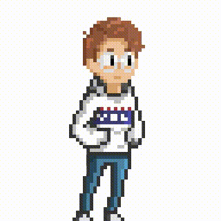

<!--  -->

    <kbd>
        
    </kbd>

<h1>Waddup, I am Bach(iro) 🖖</h1>

&ensp;

- A web developer who interested in building and designing web applications. 
- My main expertise is to create <em><strong>minimal</strong></em>, <em><strong>efficient</strong></em>, and <em><strong>easy-to-use</strong></em> products. 
- I occasionally make projects about science and random stuffs.

### :mailbox_with_no_mail: Reach out to me at:

- <strong>Gmail</strong>: <a href=''>bachvo01@gmail.com</a>
- <strong>LinkedIn</strong>: <a href ='www.linkedin.com/in/
    '>https://www.linkedin.com/in/bachiro-vo</a>
  &ensp;

### :hammer_and_wrench: Languages and Tools:

    
&ensp;
    

<!--
**bachvo01/bachvo01** is a ✨ _special_ ✨ repository because its `README.md` (this file) appears on your GitHub profile.

Here are some ideas to get you started:

- 🔭 I’m currently working on ...
- 🌱 I’m currently learning ...
- 👯 I’m looking to collaborate on ...
- 🤔 I’m looking for help with ...
- 💬 Ask me about ...
- 📫 How to reach me: ...
- 😄 Pronouns: ...
- ⚡ Fun fact: ...
  -->
